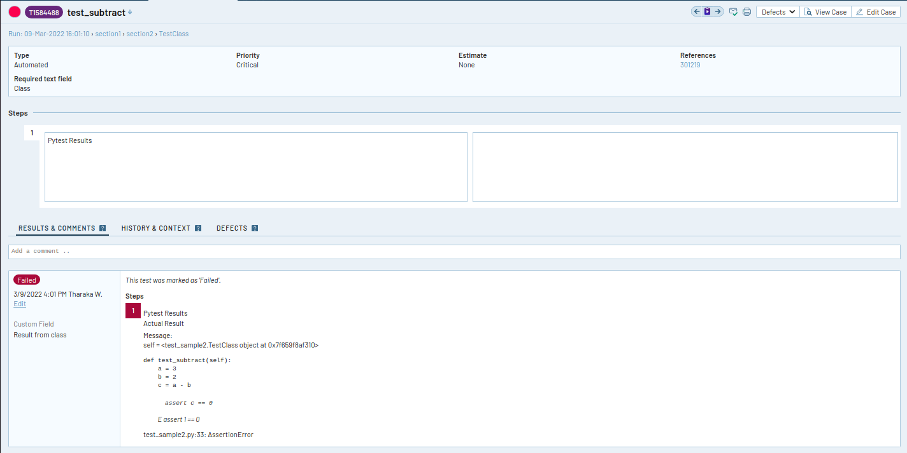

# pytest-railflow-testrail-reporter

[](https://pypi.org/project/pytest-railflow-testrail-reporter/)
[](https://github.com/railflow/railflow-pytest-plugin/actions/workflows/testing.yml)
[](https://codecov.io/gh/railflow/railflow-pytest-plugin)
[](https://lbesson.mit-license.org/)
[](https://pypi.org/project/pytest-railflow-testrail-reporter/)

pytest-railflow-testrail-reporter is a custom reporter which generates json report with  railflow markers provided during tests.
The reporter helps you to integrate your pytest test with TestRail easily by producing Json test report files which can be uploaded into TestRail by using powerful [Railflow NPM CLI](https://www.npmjs.com/package/railflow) tool.  

Requirements
============

In order to use pytest-railflow-testrail-reporter plugin, following
prerequsites should be met.

> -   Python 2.7, 3.4 or greater
> -   Pytest

Installation
============

Using Pip
---------

To install the pytest-railflow-testrail-reporter plugin using pip,run
the following command in terminal:

    pip install pytest-railflow-testrail-reporter

This will install the plugin to the system.

Usage
=====

Currently, the plugin supports the railflow configuration params given below. All
other undefined configuration params will be rejected with a warning.

### Railflow configuration params description

Config Name | Description |
------------| -------------|
title| Name of the test suite or test case|
case_type| One of the test case types defined in TestRail, e.g.: Automated, Compatibility|
case_priority| One of the case priority defined in TestRail, e.g.: Critical, High|
case_fields| Custom case fields defined in TestRail. Should input as an array of strings, e.g.: ['field1=value1','field2=value2']|
result_fields| Custom result fields defined in TestRail. Should input as an array of strings, e.g.: ['field1=value1','field2=value2']|
jira_ids| Jira IDs.These values will be populated as a case field 'refs'. Should input as an array of strings, e.g.: ['jid1','jid2']
testrail_ids| IDs of test cases in TestRail. Should input as an array of integers, e.g.: [1,2,3]
smart_failure_assignment| Array of TestRail users to automatically assign failed test cases. Should input as a string array, e.g.: ['aaa@test.com','bbb@test.com']

These railflow configurations can be either used in class level or function level.

  Function level Attributes | Class level Attributes
  --------------------------|-----------------------
  jira\_ids | case\_fields
  case\_fields | result\_fields
  result\_fields | case\_type
  testrail\_ids | case\_priority
  case\_type | smart\_failure\_assignment
  case\_priority | title
  smart\_failure\_assignment |
  title |

To run the test, enter the following command in the terminal from test
directory.

    pytest --jsonfile output.json

Examples
========

### Example 1 : pytest tests within a class

1. Install 'pytest-railflow-testrail-reporter' .

```shell
$ pip install pytest-railflow-testrail-reporter
```

2. Add pytest test with railfllow configuration params.

test_calculation.py
```shell
import pytest

@pytest.mark.railflow(
     jira_ids=["301219"],
    case_fields=[
        {
            "name": "ReQuired text field",
            "value": "Class"
        }
    ],
    result_fields=[
        {
            "name": "Custom fIeLD",
            "value": "Result from class"
        }
    ],
    case_type="Automated",
    case_priority="Critical",
    smart_failure_assignment=["user1@gmail.com, user2@gmail.com"]
)
class TestClass:

    def test_add(self):
        a = 3
        b = 2
        c = a + b
        assert c == 5

    def test_subtract(self):
        a = 3
        b = 2
        c = a - b
        assert c == 0

    @pytest.mark.railflow(
        title = "method title",
        jira_ids=["11111"],
        case_fields=[
            {
                "name": "ReQuired text field",
                "value": "method"
            }
        ],
        result_fields=[
            {
                "name": "Custom fIeLD",
                "value": "Result from method"
            }
        ],
        case_type="Compatibility",
        case_priority="High",
        smart_failure_assignment=["user3@gmail.com"],
        testrail_ids=[1]
    )
    @pytest.mark.parametrize("a,b,c", [(22, 11, 2), (64, 8, 8), (9, 3, 3)])
    def test_divide(self, a, b, c):
        assert a / b == c  
```
3. Run tests and generate report

```shell
pytest --jsonfile output.json test_calculation.py
```

4. View report file

Report file generated at the same directory where the test executed.

output.json
```shell
[
    {
        "class_name": "TestClass",
        "markers": "",
        "file_name": "test_sample",
        "attachments": [],
        "tests": [
            {
                "test_name": "test_add",
                "details": null,
                "markers": "",
                "result": "PASSED",
                "duration": 0.00010827200003404869,
                "timestamp": "2022-03-01T10:42:38",
                "message": null
            },
            {
                "test_name": "test_subtract",
                "details": null,
                "markers": "",
                "result": "FAILED",
                "duration": 0.00022401500018531806,
                "timestamp": "2022-03-01T10:42:38",
                "message": "self = <test_sample.TestClass object at 0x7febef81b2e0>\n\n    def test_subtract(self):\n        a = 3\n        b = 2\n        c = a - b\n>       assert c == 0\nE       assert 1 == 0\n\ntest_sample.py:33: AssertionError"
            },
            {
                "test_name": "test_divide",
                "details": null,
                "markers": "parametrize",
                "parameters": [
                    {
                        "name": "a",
                        "value": 22
                    },
                    {
                        "name": "b",
                        "value": 11
                    },
                    {
                        "name": "c",
                        "value": 2
                    }
                ],
                "result": "PASSED",
                "duration": 0.0001088809999600926,
                "timestamp": "2022-03-01T10:42:38",
                "message": null,
                "railflow_test_attributes": {
                    "title": "method title",
                    "jira_ids": [
                        "11111"
                    ],
                    "case_fields": [
                        {
                            "name": "ReQuired text field",
                            "value": "method"
                        }
                    ],
                    "result_fields": [
                        {
                            "name": "Custom fIeLD",
                            "value": "Result from method"
                        }
                    ],
                    "case_type": "Compatibility",
                    "case_priority": "High",
                    "smart_failure_assignment": [
                        "user3@gmail.com"
                    ],
                    "testrail_ids": [
                        1
                    ]
                }
            },
            {
                "test_name": "test_divide",
                "details": null,
                "markers": "parametrize",
                "parameters": [
                    {
                        "name": "a",
                        "value": 64
                    },
                    {
                        "name": "b",
                        "value": 8
                    },
                    {
                        "name": "c",
                        "value": 8
                    }
                ],
                "result": "PASSED",
                "duration": 9.878999981083325e-05,
                "timestamp": "2022-03-01T10:42:38",
                "message": null,
                "railflow_test_attributes": {
                    "title": "method title",
                    "jira_ids": [
                        "11111"
                    ],
                    "case_fields": [
                        {
                            "name": "ReQuired text field",
                            "value": "method"
                        }
                    ],
                    "result_fields": [
                        {
                            "name": "Custom fIeLD",
                            "value": "Result from method"
                        }
                    ],
                    "case_type": "Compatibility",
                    "case_priority": "High",
                    "smart_failure_assignment": [
                        "user3@gmail.com"
                    ],
                    "testrail_ids": [
                        1
                    ]
                }
            },
            {
                "test_name": "test_divide",
                "details": null,
                "markers": "parametrize",
                "parameters": [
                    {
                        "name": "a",
                        "value": 9
                    },
                    {
                        "name": "b",
                        "value": 3
                    },
                    {
                        "name": "c",
                        "value": 3
                    }
                ],
                "result": "PASSED",
                "duration": 9.954699999070726e-05,
                "timestamp": "2022-03-01T10:42:38",
                "message": null,
                "railflow_test_attributes": {
                    "title": "method title",
                    "jira_ids": [
                        "11111"
                    ],
                    "case_fields": [
                        {
                            "name": "ReQuired text field",
                            "value": "method"
                        }
                    ],
                    "result_fields": [
                        {
                            "name": "Custom fIeLD",
                            "value": "Result from method"
                        }
                    ],
                    "case_type": "Compatibility",
                    "case_priority": "High",
                    "smart_failure_assignment": [
                        "user3@gmail.com"
                    ],
                    "testrail_ids": [
                        1
                    ]
                }
            }
        ],
        "railflow_test_attributes": {
            "jira_ids": [
                "301219"
            ],
            "case_fields": [
                {
                    "name": "ReQuired text field",
                    "value": "Class"
                }
            ],
            "result_fields": [
                {
                    "name": "Custom fIeLD",
                    "value": "Result from class"
                }
            ],
            "case_type": "Automated",
            "case_priority": "Critical",
            "smart_failure_assignment": [
                "user1@gmail.com, user2@gmail.com"
            ]
        }
    }
]
```
5. Install Railflow CLI

```shell
npm install railflow
```

6. Run Railflow CLI and upload test results into TestRail

```shell
npx railflow -k ABCDE-12345-FGHIJ-67890 -url https://testrail.your-server.com/ -u testrail-username -p testrail-password -pr "Railflow Demo" -path section1/section2 -f pytest-railflow -r pytest/*.json
```

Where:

k - Railflow license key\
url - the URL of the TestRail server\
u - TestRail user name\
p - TestRail user password\
pr - name of the project in TestRail\
path - path to the subsection in TestRail where test cases will be exported to\
f - test report format - `pytest-railflow`\
r - path to the report XML files

Please see [Railflow NPM documentation](https://docs.railflow.io/cli/railflow-npm/) for the all the details about Railflow CLI options.

7. View results in TestRail

#### Test run


#### Test result details



Please check
[examples](https://github.com/railflow/railflow_pytest_examples)
for more information and sample tests.

License
=======

This software is licensed under the [MIT license](https://lbesson.mit-license.org/)

See [License file](https://github.com/railflow/railflow-pytest-plugin/blob/main/LICENSE) for more information.
